<div align="center">



<a href="https://git.io/typing-svg"></a>

<br/>

<a href="https://www.linkedin.com/in/shramik-masti-5bb3a1212/"></a>
<a href="mailto:shramik0076@gmail.com"></a>
<a href="https://stackoverflow.com/users/20370773/shramik-masti?tab=profile"></a>
<a href="https://www.instagram.com/http._shramik/"></a>

</div>


## 🌿 About Me

I'm a **Backend Developer at [Telusko](https://telusko.com)** who builds scalable Spring Boot applications and AI powered systems. My foundation is Java and the Spring ecosystem, and these days I spend most of my time turning LLMs into reliable products with **Spring AI, LangChain and LangGraph**.

```yaml
name:       Shramik Masti
role:       Java Developer @ Telusko
based_in:   Maharashtra, India
core:       [Java, Spring Boot, Spring Security, Spring Data JPA, Microservices, REST APIs]
ai_stack:   [Spring AI, LangChain, LangGraph, LangChain4j, MCP]
learning:   System Design, architecting efficient backend systems
open_to:    [Open Source, Enterprise Application Development]
off_duty:   Hiking trails ⛰️ and new coffee blends ☕
```


## 🪶 My Journey



<table>
<tr>
<td width="50%" valign="top">

### 💠 Java Developer · Telusko
<sub>March 2025 · Present</sub>

- Built a **Learning Management System** on Spring Boot with secure APIs and user management
- Integrated **payments** for course purchases
- Built an **AI Tutor** with Spring AI that gives adaptive responses and evaluates learners
- Building **agentic applications** with LangChain and LangGraph

</td>
<td width="50%" valign="top">

### 🔹 Java Developer Intern · Code Crafter Services
<sub>April 2024 · February 2025</sub>

- Backends for **POS (café), inventory, e-commerce, GST and task management** systems
- Spring Boot, Spring Data JPA, Spring Security and REST APIs
- Moved file and image storage to **Amazon S3**, improving scalability and cutting processing time

</td>
</tr>
</table>

<sub>🎓 **MCA**, D.Y. Patil Agriculture &amp; Technical University (2023 onwards) &nbsp;·&nbsp; **BSc Computer Science**, Dr. Ghali College (2020 to 2023)</sub><br/>
<sub>📜 Spring &amp; Microservices · Industry Ready Java Spring Developer &nbsp;·&nbsp; 🎤 Attended Google Developer Event, Pune</sub>


## 🐉 The Hero I Follow



Jake Sully landed on Pandora as an outsider who knew nothing about that world. He ended up as Toruk Makto, and later as the leader of the Omatikaya. I don't follow him because he wins every fight. I follow him for the way he gets there, and I try to bring the same habits to my own work.

| | What Jake does | How I carry it into my work |
|:-:|---|---|
| 🌱 | **Learns from zero.** He arrives with no idea how Pandora works and learns everything from Neytiri, one fall at a time. | Every new stack is my Pandora. I went from Java basics to Spring Boot, and then to Spring AI, LangGraph and MCP, by being a beginner again each time. |
| 👁️ | **"I See You."** For the Na'vi, seeing means understanding someone, which goes deeper than looking at them. | Before I write code, I try to understand the user and the real problem behind the ticket. |
| 🔗 | **Tsaheylu, the bond.** He earns his ikran's trust, and that trust runs both ways. | I build that bond between Java backends and AI models, and with the teammates I build alongside. |
| 🐉 | **Toruk Makto.** He takes on the challenge nobody else dares to try. | When a problem looks impossible, I want to be the one who picks it up. Today that means agentic AI in production. |
| 🛡️ | **Protects his family.** In *The Way of Water* he puts his family and his people first. | I take ownership of what I ship, from security and tests to the stability of production. |


## 🔷 Tech Stack

<div align="center">


<br/><br/>


<br/><br/>


</div>


## 🪐 Featured Projects

<div align="center">

<a href="https://github.com/the-shramik/RealTime-InterviewBot"></a>
<a href="https://github.com/the-shramik/Spring-AI-Agentic-Patterns"></a>
<a href="https://github.com/the-shramik/AI-Engineering-Project-Spring-AI-"></a>
<a href="https://github.com/the-shramik/payment-gateway-spring-boot"></a>

</div>


## 📡 GitHub Activity

<div align="center">


</div>

<div align="center">




</div>
